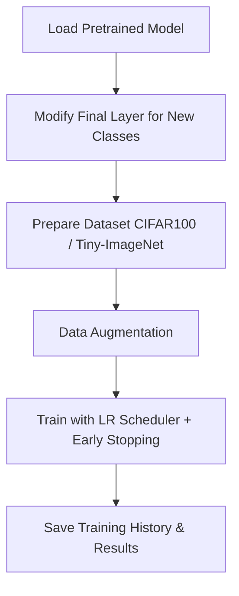
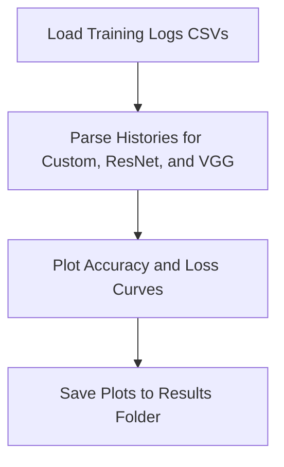
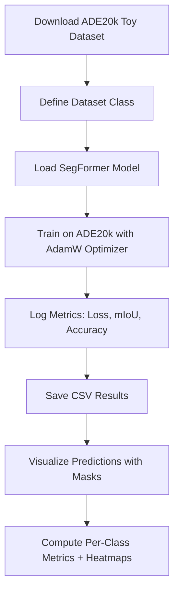

### Experiment 2 – Transfer Learning & Semantic Segmentation

This folder contains Jupyter notebooks for Experiment 2, covering:

- Part A: Transfer learning with a custom topology on CIFAR100 & Tiny-ImageNet.
- Part A (Analysis): Visualization of results for Custom, ResNet, and VGG models.
- Part B: Semantic segmentation using HuggingFace SegFormer on ADE20k toy dataset.


## 📂 Notebooks
# 1. experiment2_A_custom_topology.ipynb
- Loads a pretrained custom model.
- Prepares datasets (CIFAR100, Tiny-ImageNet).
- Applies data augmentation (ImageDataGenerator).
- Rebuilds model with adjusted output layers for new class counts.
- Trains with early stopping and learning rate scheduling.
- Saves training history (CSV) and plots.
  
# Pipeline:

## 2. experiment2_A_csv_to_plot.ipynb

- Reads CSV logs from Part A & baselines (ResNet, VGG19).
- Generates side-by-side plots:
  - Training vs Validation Accuracy
  - Training vs Validation Loss
  - Saves plots into corresponding result directories.

# Pipeline:

## 3. experiment2_B.ipynb
- Downloads and extracts ADE20k toy dataset.
- Defines custom PyTorch Dataset for segmentation.
- Fine-tunes SegFormer (nvidia/mit-b0).
- Logs metrics: Loss, Mean IoU, Mean Accuracy.
- Produces overlays of predictions with segmentation masks.
- Generates per-class metrics and heatmaps for Accuracy & IoU.

# Pipeline:

## 🚀 How to Run
# Prerequisites
- Python 3.8+
- Jupyter Notebook or JupyterLab
- Install dependencies:
  ```bash
  pip install tensorflow keras torch torchvision transformers datasets evaluate imageio pandas matplotlib seaborn
  ```
# Running
1. Open JupyterLab/Notebook:
  ```bash
  jupyter notebook
  ```
2. Navigate to this folder (experiment2/).
3. Run each notebook cell sequentially.

# 📊 Outputs

1. Experiment 2A (Custom Topology)
   - Training history CSVs.
   - Accuracy & Loss plots.

2. Experiment 2A (Analysis)
  - Comparative plots (Custom, ResNet, VGG).

3. Experiment 2B (Segmentation)
   - training_results.csv.
   - Segmentation overlay images.
   - Heatmaps for class-wise Accuracy & IoU.
   - Detailed per-class metrics CSV.

# ⚡ Note: You don’t need to rerun all training to see results. Pre-generated CSV logs, plots, and visualizations are available in the Releases tab

# Demonstrates:

1. Transfer Learning for Image Classification
   - How a pretrained model (custom, ResNet, or VGG) can be fine-tuned on new datasets (CIFAR100, Tiny-ImageNet).
   - The effect of modifying final layers to match new class counts.
   - Comparison of training performance across different architectures.
   - Visualization of training/validation accuracy and loss to evaluate convergence and overfitting.
2. Semantic Segmentation with Pretrained Transformers
   - Fine-tuning a SegFormer model on ADE20k toy dataset.
   - Generating pixel-level predictions and overlays to visualize segmentation.
   - Computing per-class metrics, including Mean IoU and Accuracy.
   - Understanding how transfer learning accelerates convergence even on small datasets.
3. Key Takeaways:
   - Pretrained networks significantly reduce training time and improve performance when adapting to new tasks.
   - Visualization of metrics and overlays helps interpret model behavior and segmentation quality.
   - Provides a modular workflow that can be extended to larger datasets or other pretrained models.
